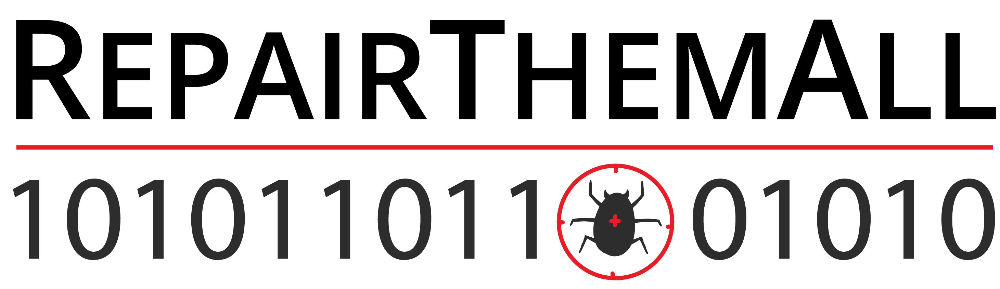

# The RepairThemAll Framework

RepairThemAll is a framework that allows the execution of automatic program repair tools on benchmarks of bugs by providing an abstraction around the repair tools and the benchmarks.

If you use RepairThemAll, please cite our paper:

```bibtex
@inproceedings{RepairThemAll2019,
  author    = {Thomas Durieux and Fernanda Madeiral and Matias Martinez and Rui Abreu},
  title     = {{Empirical Review of Java Program Repair Tools: A Large-Scale Experiment on 2,141 Bugs and 23,551 Repair Attempts}},
  booktitle = {Proceedings of the 27th ACM Joint European Software Engineering Conference and Symposium on the Foundations of Software Engineering (ESEC/FSE '19)},
  year      = {2019},
  url       = {https://arxiv.org/abs/1905.11973}
}
```

## Table of Contents

1. [Features](#1-features)
2. [Supported repair tools](#2-supported-repair-tools)
3. [Supported benchmarks of bugs](#3-supported-benchmarks-of-bugs)
4. [Repository structure](#4-repository-structure)
5. [Usage](#5-usage)
6. [Extending RepairThemAll to add support for different repair tools and benchmarks of bugs](#6-extending-repairthemall-to-add-support-for-different-repair-tools-and-benchmarks-of-bugs)
7. [Reproduce the experiment reported in the paper using RepairThemAll](#7-reproduce-the-experiment-reported-in-the-paper-using-repairthemall)

## 1. Features

* Execution of repair tools on benchmarks of bugs
* Configuration of the environment to execute repair tools properly on the bugs
* Multi-process execution
* [Grid5000](https://grid5000.fr) cluster support

## 2. Supported repair tools

| #  | Tool          | Language | Repository                         | Commit id |
| -- | ------------- | -------- | ---------------------------------- | --------- |
| 1  | Nopol         | Java     | https://github.com/SpoonLab/nopol  | 7ba58a78d |
| 2  | DynaMoth      | Java     | https://github.com/SpoonLab/nopol  | 7ba58a78d |
| 3  | NPEFix        | Java     | https://github.com/SpoonLab/npefix | 403445b9a |
| 4  | jGenProg      | Java     | https://github.com/SpoonLab/Astor  | 26ee3dfc8 |
| 5  | jKali         | Java     | https://github.com/SpoonLab/Astor  | 26ee3dfc8 |
| 6  | jMutRepair    | Java     | https://github.com/SpoonLab/Astor  | 26ee3dfc8 |
| 7  | Cardumen      | Java     | https://github.com/SpoonLab/Astor  | 26ee3dfc8 |
| 8  | ARJA          | Java     | https://github.com/yyxhdy/arja     | e60b990f9 |
| 9  | GenProg-A     | Java     | https://github.com/yyxhdy/arja     | e60b990f9 |
| 10 | RSRepair-A    | Java     | https://github.com/yyxhdy/arja     | e60b990f9 |
| 11 | Kali-A        | Java     | https://github.com/yyxhdy/arja     | e60b990f9 |


## 3. Supported benchmarks of bugs

| # | Benchmark      | Language | # Projects | # Bugs | Link                                           |
| - | -------------- | -------- | ----------:| ------:| ---------------------------------------------  |
| 1 | Bears          | Java     |         71 |    251 | https://github.com/bears-bugs/bears-benchmark  |
| 2 | Bugs.jar       | Java     |          8 |  1,158 | https://github.com/bugs-dot-jar/bugs-dot-jar   | 
| 3 | Defects4J      | Java     |          6 |    395 | https://github.com/rjust/defects4j             |
| 4 | IntroClassJava | Java     |          6 |    297 | https://github.com/Spirals-Team/IntroClassJava |
| 5 | QuixBugs       | Java     |         40 |     40 | https://github.com/jkoppel/QuixBugs            |
|   | **Total**      |          |        130 |  2,051 |                                                |

## 4. Repository structure

This repository is structured as follow:

```
├── benchmarks: contains a git submodule per benchmark plugged-in RepairThemAll
├── data: 
│ ├── benchmarks: contains additional information/files on benchmarks
│ ├── repair_tools: contains information on repair tools, e.g. the launcher class name
├── libs: contains the dependencies
├── repair_tools: contains a jar file per repair tool (e.g. npefix.jar) or per repair framework where several repair tools are implemented (e.g. astor.jar)
├── script: contains the actual scripts of RepairThemAll that use everything mentioned above to run repair tools on benchmarks of bugs
│ ├── Main files:
│ ├── config.py: contains the parameters of RepairThemAll (see INSTALL.md file)
│ ├── repair.py: contains the script to run a repair tool on a benchmark
│ └── print_bugs_available.py: contains the script to print the bugs available from a benchmark
```

## 5. Usage 

RepairThemAll can be executed directly from the **source** or via a **Docker** image where RepairThemAll has been pre-configured and is ready to be used. One can find the usage instructions [here](INSTALL.md).

## 6. Extending RepairThemAll to add support for different repair tools and benchmarks of bugs

To add a new benchmark or a new repair tool, see the instructions [here](EXTEND.md).

## 7. Reproduce the experiment reported in the paper using RepairThemAll

The results reported in the paper are at [program-repair/RepairThemAll_experiment](https://github.com/program-repair/RepairThemAll_experiment).

In order to reproduce those results, the 11 repair tools need to be executed on the 5 benchmarks. Warning: the experiment took 313 days of combined execution time.

That execution requires a command line for each pair of repair tool and benchmark (totaling 55 command lines) as following:

```bash
python script/repair.py Nopol --benchmark Defects4J
python script/repair.py Nopol --benchmark Bears
...
```
